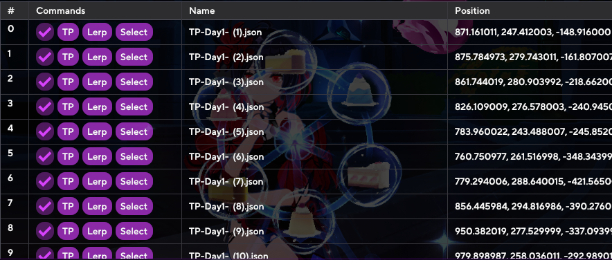

## How to use custom TP

## Step 1: Settings to use

We will use the following settings.

The recommended delay time is >15s.

## Step 2: Download the `.json` files for the custom tp

We can find these files in `community-share` pinned post in the server. Download the ones that suits your needs.

## Step 3: Select the tp files

Head to custom tp settings and go to this section:

Click on select path and select the folder containing the tp files you want to use.

## Step 4: How to start the tps

After selecting the folder, check this checkbox:

After that we click on `Select`:

## Step 5: Enjoy the ride

The TPs will start automatically, if you got [Sponsor](../start/sponsor.md), you will be able to see the progress and remaining time.

