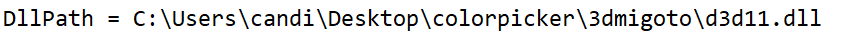

## Nota:

### Si en el cmd de GIMI sale `echo off` puedes presionar `Numpad 0` para quitarlo o

### editar `d3dx.ini` y buscar `hunting=` y cambialo a `0`.

## Como usar skins personalizadas en Korepi

Para poder usar skins personalizadas en Korepi tendremos que descargar la aplicación de 

`3DMigoto(GIMI)`.
## Método 1
### Paso 1: Descargar `GIMI`

Descarga `GIMI` desde su [Github](https://github.com/SilentNightSound/GI-Model-Importer/releases/tag/v7.0) oficial, descarga el archivo llamado `3dmigoto-GIMI-for-playing-mods.zip`.

### Paso 2: Extraer la carpeta de `GIMI`

Después de descargar `GIMI`, lo extraemos en cualquier carpeta en el escritorio, dentro de esa carpeta encontraremos un archivo llamado `d3d11.dll`, copiaremos el directorio y añadiremos `/d3d11.dll`.

`"directorio/d3d11.dll"`

### Paso 3: Añadir `GIMI` a Korepi

Para esto tendremos que añadir las siguientes lineas al archivo llamado `cfg.ini` dentro de la carpeta de Korepi.

En `DllPath` pegaremos nuestro directorio mencionado en el paso anterior.

### Paso 4: Abrir Korepi

Después de realizar los pasos mencionados, GIMI se abrirá junto a Korepi cada vez que abras Korepi.

## Método 2
### Paso 1: Descargar `GIMI`

Descarga `GIMI` desde su [Github](https://github.com/SilentNightSound/GI-Model-Importer/releases/tag/v7.0) oficial, descarga el archivo llamado `3dmigoto-GIMI-for-playing-mods.zip`.

### Paso 2: Extraer la carpeta de `GIMI`

Después de descargar `GIMI`, lo extraemos en cualquier carpeta en el escritorio, dentro de esa carpeta encontraremos un archivo llamado `3DMigoto Loader.exe`, lo abriremos primero.

### Paso 3: Abrir Korepi

Abriremos Korepi después de abrir `GIMI`, y se ejecutaran los dos juntos, tendrás que hacer el paso 2 cada vez que quieras usar `GIMI`.

