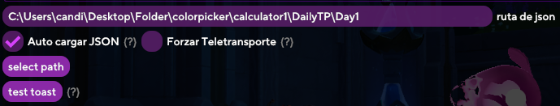

## Como usar Teletransportes personalizados

### Paso 1: Configuración 

Lo configuraremos de la siguiente manera:

El tiempo de retraso recomendado es de >15s.

### Paso 2: Descargar los archivos `.json` para los teletransportes

Para ello podremos encontrarlo en el canal de `community-share` en la publicación fijada. Lo descargaremos y lo extraemos en cualquier carpeta.

### Paso 3: Seleccionar los teletransportes deseados

Entraremos en los ajustes dentro de Korepi de nuevo e iremos a la siguiente sección:

Le daremos click a select path, y elegiremos la carpeta de los teletransportes que deseamos utilizar.

### Paso 4: Empezar los teletransportes

Después de seleccionar los teletransportes deberemos de darle a la siguiente casilla:

La activamos y le damos a `Seleccionar Botón0`: 

### Paso 5: Disfrutar

Ahora los teletransportes empezaran, si tienes [Sponsor](../start/sponsor.md) habrá un contador del tiempo que tardara.

