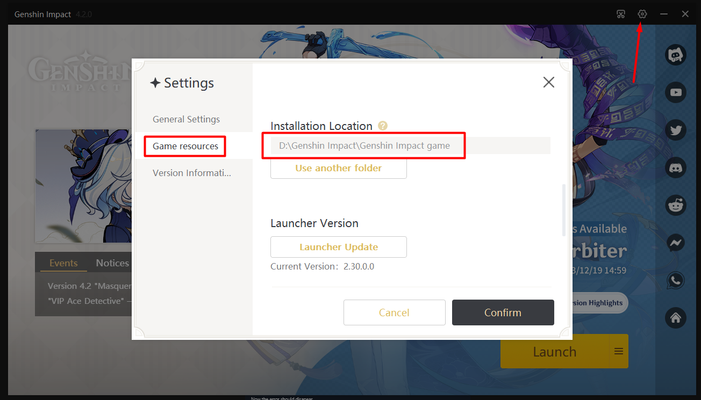
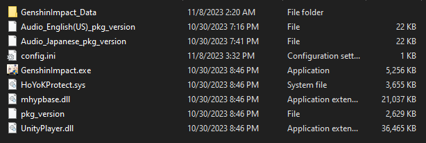

## Como solucionar el error `31-4302`

### Metodo 1

Comprueba que tu juego contenga solo archivos originales, si hay alguno que no lo es, sacalo de la carpeta, como el siguiente ejemplo:

Si sigues teniendo el error sigue leyendo.

### Metodo 2

Ve a Korepi y ve a `Settings --> Other`.

Encuentra `Bypass Intengrity` y deshabilita la opción.

El error deberia desaparecer.

## Que hago si no puedo entrar a Korepi?

Ve a tu carpeta de Korepi y encuentra `cfg.json`, usa `CTRL + F`, y escribe `bypass` y le das a buscar, cambia el valor a `false` y abre Korepi de nuevo.

## Que hago si no funciona

Tendras que reinstalar el juego completamente.

