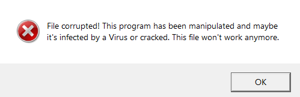
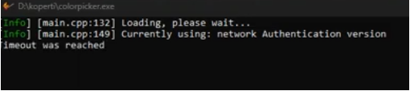
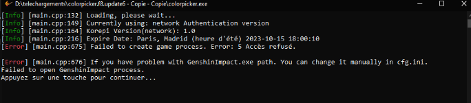
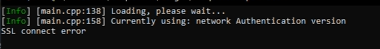

## Lista de errores frecuentes

## Por qué mi Korepi desaparece?

Deshabilita el anti-virus y crea una carpeta nueva, pon korepi dentro y añadelo a exclusiones dentro del anti-virus:

Abre Korepi depuès de haber completado este paso.

## Status: No active subscribtion(s) found, Invalid license key

Necesitas [conseguir una nueva key](../guide/getkey.md) en `⁠★⋅micah-bot-verify⋅★`, si no puedes conseguir una key o si no te funciona la key tendras que esperar hasta que se caduque.

`Los Sponsors pueden usar F:Reset Key para conseguir una nueva.`

## [DLL injection]  Process crashed, exit code 0xc000005

Abre el cmd como administrador y escribe lo siguiente:

`sfc /scannow`

Si se encontraron errores, reinicia el ordenador y comprueba si funciona.

Si al reiniciar no funciona o si no se encontró errores, prueba lo siguiente:

`DISM.exe /Online /Cleanup-Image /RestoreHealth`

Después de completar ese paso, reinicia el ordenador y comprueba si funciona, si no funciona tendras que reisntalar windows.

## ImGUI: DirectX11 backend initialized successfully.

Este error ocurre por los temas instalados, borra tu carpeta de `themes`.

## El sistema no detecto MSVCP140.dll

Actualiza o Instala [Microsoft Visual Studio C++](https://learn.microsoft.com/en-us/cpp/windows/latest-supported-vc-redist?view=msvc-170#visual-studio-2015-2017-2019-and-2022).

Actualiza o Instala [DirectX](https://www.microsoft.com/en-us/download/details.aspx?id=35).

## El Archivo está corrupto! ¡Este programa ha sido manipulado!

En este caso deberas instalar `Malware Bytes` o `Dr.Web` y hacer un escaneo completo, si se encuentra un virus, borralo, y reinicia el ordenador, si no funciono, deberas reinstalar windows.

## Timeout was reached

Reinicia tu router.

Asegúrate de que ninguna aplicación te esté bloqueando la conexión como el antivirus.

## DLL Injection failed

Reinstala el mod.

## Windows cannot access the specified device, path, or file

Prueba [esto](https://www.minitool.com/es/respaldar-datos/windows-no-tiene-acceso-al-dispositivo-especificado.html) primero.

Haz un escaneo de virus.

Si no funciona abre `cmd` como administrado y escribe `sfc /scannow`.

Si se encontraron errores, reinicia el ordenador y comprueba si funciona.

Si al reiniciar no funciona o si no se encontró errores, prueba lo siguiente:

`DISM.exe /Online /Cleanup-Image /RestoreHealth`

Después de completar ese paso, reinicia el ordenador y comprueba si funciona, si no funciona tendras que reisntalar windows.

## Signature checksum failed

Los servidores están caídos, espera a que vuelvan.

## Failed to create game process with Error 5

Borra `cfg.ini`.

## SSL connect error

Reinicia tu router y ordenador.

Usa un VPN si sigue sin funcionar.

