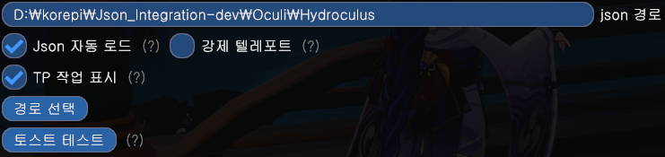
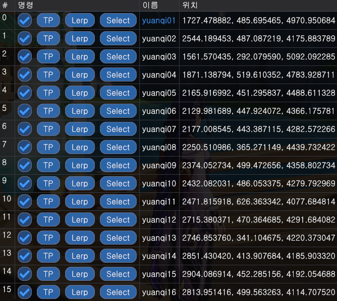

## 커스텀 tp 사용 방법

### 1단계: 사용할 설정

다음과 같은 설정을 사용하겠습니다.

권장되는 지연 시간은 15초 이상입니다.

### 2단계: 커스텀 tp에 대한 `.json` 파일들을 다운로드합니다.

서버의 `community-share`에 있는 고정된 메세지에서 파일들을 찾을 수 있습니다. 필요한 파일을 다운로드하세요.

### 3단계: tp 파일들 선택

커스텀 텔레포트 설정으로 이동하세요.

경로 선택을 클릭하고, 사용하려는 tp 파일이 포함된 폴더를 선택하세요.

### 4단계: tp를 시작하는 방법

폴더를 선택한 후, 체크박스를 체크합니다:

그런 다음 `Select`를 클릭합니다:

### 5단계: 즐기기

tp는 자동으로 시작됩니다. [스폰서](../start/sponsor.md)라면 진행 상황과 남은 시간을 확인할 수 있습니다.

## 동영상

<iframe width="640" height="360" src="https://www.youtube.com/embed/1ft6xYr2EmM" title="Part 1 - How to Use &#39;Custom Teleports&#39; in Colorpicker or Calculator" frameborder="0" allow="accelerometer; autoplay; clipboard-write; encrypted-media; gyroscope; picture-in-picture; web-share" allowfullscreen></iframe>

