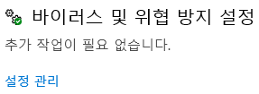
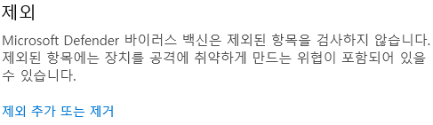

::: info 다른 바이러스 백신도 비슷한 단계를 따릅니다.
:::
---
## 제외 목록에 Korepi를 추가하는 방법 (Windows Defender)

### 1단계: 바이러스 백신을 실행합니다.

Windows 검색창을 열고 `Windows 보안`을 검색하여 실행합니다.

`바이러스 및 위협 방지`를 클릭합니다.

`바이러스 및 위협 방지 설정`을 찾고 `설정 관리`를 클릭합니다.

### 2단계: 제외 목록에 추가하기

아래로 스크롤하여 `제외`를 찾고 `제외 추가 또는 제거`를 클릭합니다.

`제외 사항 추가`에서 폴더를 클릭하고, Korepi 폴더를 선택합니다.

## 동영상

<iframe width="640" height="360" src="https://www.youtube.com/embed/BonLkFNnO9w" title="How to Exclude a File or Folder from Windows Defender Scan In Windows 10 [Tutorial]" frameborder="0" allow="accelerometer; autoplay; clipboard-write; encrypted-media; gyroscope; picture-in-picture; web-share" allowfullscreen></iframe>

