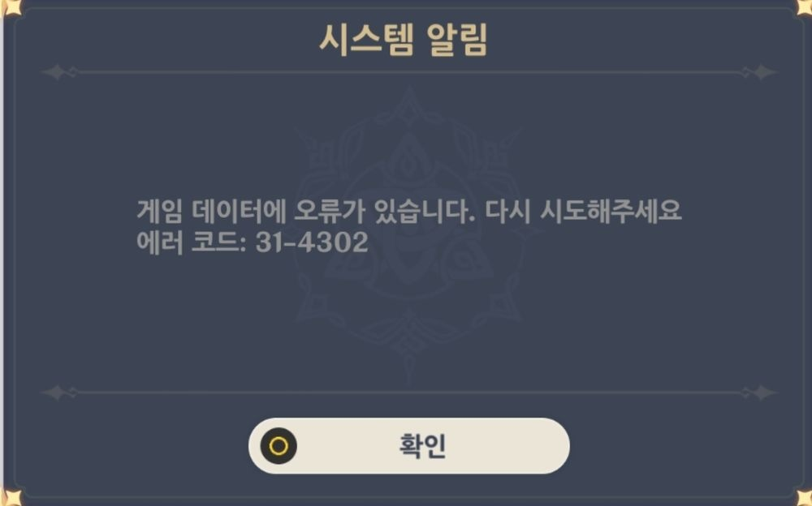
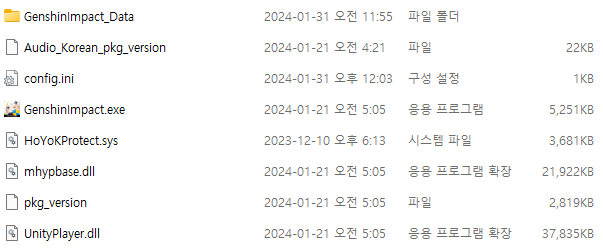
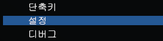

## 에러 코드: `31-4302` 해결 방법

### 방법 1

게임 폴더에 원본이 아닌 파일이 있을 때 나타날 수 있습니다. 다음 예시와 같은 원본 파일만 있는지 확인하세요: 

파일을 삭제한 후에도 게임 내에 에러가 발생한다면 계속 읽으세요.

### 방법 2

Korepi에서 `설정`에 갑니다.

`무결성 우회`를 찾고 체크를 풉니다.

이제 에러가 사라져야 합니다.

## Korepi를 실행할 수 없습니다.

korepi 폴더에 있는 `cfg.json`을 열고, `CTRL + F`로 `bypass`를 검색해서 값을 `false`로 설정한 뒤 Korepi를 실행합니다.

## 아무것도 되지 않습니다.

게임을 재설치하세요.

