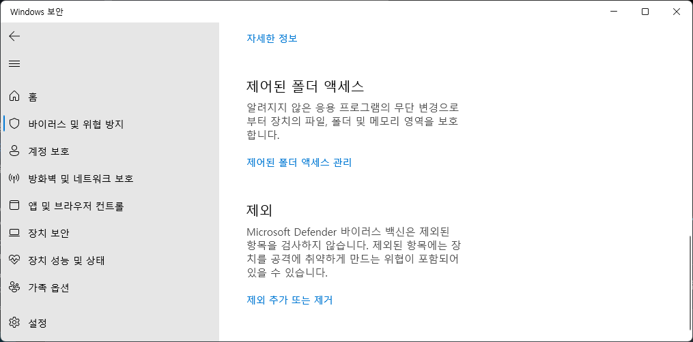
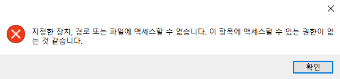

## 일반적인 오류 목록

### 왜 Korepi가 사라지나요?

바이러스 백신을 비활성화하세요, 새로운 폴더를 만들고 제외 목록에 추가합니다.

제외한 폴더에 Korepi를 압축 해제하고 다시 실행합니다.

---

`⁠🔐｜verification`에서 [새로운 키](../guide/getkey.md)를 획득해야 합니다. 키를 얻을 수 없거나 키가 작동하지 않으면 키가 만료될 때까지 기다려야 합니다.

`스폰서는 F:Reset Key를 사용할 수 있습니다.`

### [DLL injection]  Process crashed, exit code 0xc000005

`cmd`를 관리자 권한으로 실행하고 아래 명령을 입력합니다:

`sfc /scannow`

오류가 발견되면 컴퓨터를 재시작하고 확인합니다.
재시작해도 효과가 없거나 오류가 발견되지 않으면 아래 명령을 입력합니다.

`DISM.exe /Online /Cleanup-Image /RestoreHealth`

확인이 끝나면 컴퓨터를 재시작하고 확인합니다.

그래도 안되면 윈도우를 재설치하세요.

---
### ImGUI: DirectX11 backend initialized successfully.

테마가 설치된 후 오류가 발생했다면, `themes` 폴더를 비우세요.

---
### The system did not detect MSVCP140.dll

[Microsoft Visual Studio C++](https://learn.microsoft.com/en-us/cpp/windows/latest-supported-vc-redist?view=msvc-170#visual-studio-2015-2017-2019-and-2022)를 업데이트하세요.

[DirectX](https://www.microsoft.com/en-us/download/details.aspx?id=35)를 업데이트하세요.

---
### File corrupted! This program has been manipulated and maybe it's infected.

이 경우 `Malware Zero`나 `V3` 등의 바이러스 백신에서 전체 스캔을 하고, 바이러스가 발견되면 제거한 다음 재부팅하여 다시 시도해야 합니다. 문제가 해결되지 않으면 Windows를 재설치하는 것이 가장 쉬운 방법입니다.

---
### Timeout was reached

라우터를 재부팅합니다.

바이러스 백신이 연결을 차단하고 있을 수 있습니다. 작업 관리자에 없는지 확인하세요.

VPN을 사용하여 재시도 해보세요.

방화벽에 영향을 미치는 모든 프로그램을 꺼도 작동하지 않으면 네트워크에 문제가 있을 수 있습니다.

---
### DLL Injection failed

colorpicker 폴더를 삭제하고 다시 다운로드합니다.

---
### “지정한 장치, 경로 또는 파일에 액세스할 수 없습니다.”

[여기](https://support.microsoft.com/ko-KR/topic/프로그램이나-파일을-설치-업데이트-또는-시작하려고-하면-지정한-장치-경로-또는-파일에-액세스할-수-없습니다-오류가-발생함-46361133-47ed-6967-c13e-e75d3cc29657)에 있는 게시글의 단계를 따르세요.

`V3` 또는 `Malware Zero` 등의 바이러스 백신을 이용해 시스템 검사를 해보세요!

도움이 되지 않으면 cmd를 관리자 권한으로 실행하고 `sfc /scannow`를 입력하세요.

After that, if errors were found, restart the computer and check.

If after restarting it didn't help or no errors were found, write this command:

`DISM.exe /Online /Cleanup-Image /RestoreHealth`

After completing the checks, restart the computer and check again.

If it doesn't work, reinstall Windows.

---
### Signature checksum failed

Servers are down or shut down, wait for servers to come back online.

---
### Failed to create game process with Error 5

Delete `cfg.ini`.

---
### SSL connect error

Restart your PC, restart your router.

Try using a VPN if it doesn't work.

---
### Failed to detect game version

Update your program, follow the steps [here](../start/download.md)

---
### File ok

Delete your cfg.json, something might be wrong with the file.

---
### UserAssembly.dll isn't initialized, waiting for 2 sec.

If your program crashes after this line try the following steps:

Turn off all anti-viruses in PC.

If its doesn't help use `sfc /scannow` command in cmd as administrator.

If errors are found after checking and Windows is unable to resolve them, use the `DISM.exe /Online /Cleanup-Image /RestoreHealth` command. 

After checking restart your computer and try to run colorpicker again.

If the error repeats you can make factory reset of Windows.

### Current data does not exist or server error.

Unpause your license and try again.

---
### Cannot verify current timestamp.

Case 1:
- You might get this error while using a VPN, please disable it and try again.

Case 2:
- Check that your PC time is set to automatic sync.

::: info If you are from Iran you might need to use a VPN instead.
:::

---
### Unable to open file to write public key:

- This error might happen if you got your game installed in other drive other than your main drive `C:/` , to solve it you can reinstall the game to the main drive and run Korepi again.

---
### Failed to get response from https://md5c...

- This error might happen if your conection is not stable or your conection to the website its blocked, please copy the link and check if you can access it. If you can't access the website, using a VPN might help.

---
### Received code is not 200 from https://md5c...

- This Error will appear if your key is paused, please head to `🔐｜verification` and click on `Unpause Key` and type `Yes` on the pop-up.