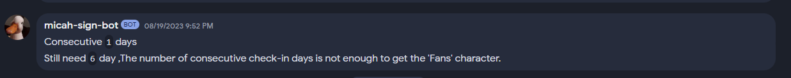

## Giới thiệu

Chào mừng đến với cộng đồng của chúng tôi! Để đăng kí và lấy được Role "Fans", hãy làm theo các bước sau.

## Bước 1: Tham gia vào server và lấy Role "Newcomer" nếu bạn chưa có

Nếu bạn chưa có mặt trên máy chủ, vui lòng đọc những bài trước đó, nơi nó được mô tả cách tham gia máy chủ và lấy Role "Newcomer".

## Bước 2: Tìm đến bot
Giờ bạn cần tìm đến bot với ảnh đại diện là một con ngỗng và viết tin nhắn trực tiếp cho nó (micah-sign-bot#0245)

## Bước 3: Điểm danh

Viết lệnh `/sign-in` và giải captcha.
Lưu ý: nếu như bot không phải hồi với mã captcha bạn yêu cầu, có thể là bạn đã nhập sai. Hãy thử viết lại captcha. 

Sau khi nhập thành công, bot sẽ gửi cho bạn thông báo `"Consecutive <days> days"` như ảnh dưới

## Bước 4: Sau khi nhận Role "Fans"

Như vậy bây giờ bạn cần nhập lệnh này hằng ngày trong vòng 7 ngày (mỗi 24 giờ). 
**Lưu ý** rằng nếu bạn chỉ cần trễ vài giờ, thì bot sẽ coi như bạn không điểm danh vào ngày hôm đó và bạn sẽ phải bắt lại từ đầu.
Vào ngày thứ 7 khi bạn đã điểm danh thành công, bạn sẽ được nhận Role "Fans", và bạn có thể dừng điểm danh.

