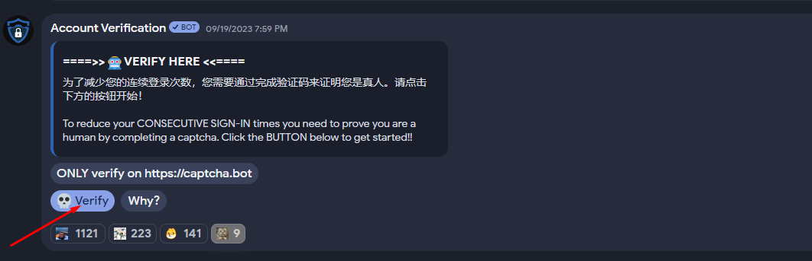

## Giới thiệu

Chào mừng đến với cộng đồng của chúng tôi! Để vượt qua quá trình xác minh bot và lấy Role "Newcomer", hãy làm theo các bước sau.

## Bước 1: Tham gia vào server của chúng nếu như bạn chưa tham gia

Nếu bạn chưa có mặt trên máy chủ, vui lòng đọc [bài trước đó](join.md), nơi nó được mô tả cách tham gia máy chủ.

## Bước 2: Bạn đã ở trong server

Bây giờ bạn đang ở trên máy chủ, hãy chọn các kênh và role cần thiết từ danh sách, sau đó chuyển sang kênh **★⋅rules⋅★**

## Bước 3: Kênh ★⋅rules⋅★ 

Trong kênh **★⋅rules⋅★** , hãy làm quen với các luật và trải qua quá trình xác minh để xác nhận rằng bạn không phải là robot. 

Nhấn vào nút **Verify** như hình bên dưới.

Bot sẽ gửi cho bạn một đường link mà bạn cần làm theo và xác nhận rằng bạn không phải là Robot

## Step 4: Sau khi nhận được Role "Newcomer"

Sau khi đã xác thực thành công, bot sẽ tự động gắn cho bạn Role "Newcomer". Với Role này, bạn sẽ không bị đá ra khỏi máy chủ mà không có bất cứ lí do nào. Giờ hãy đến với bước tiếp theo.