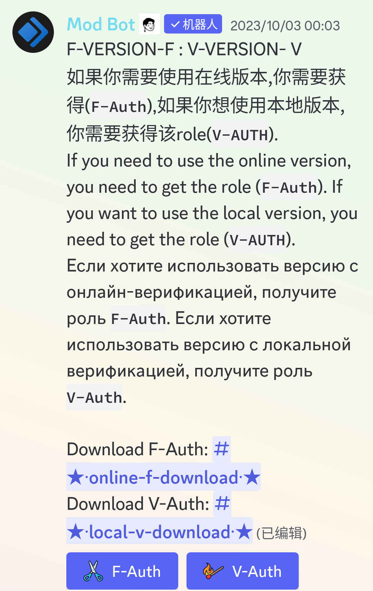
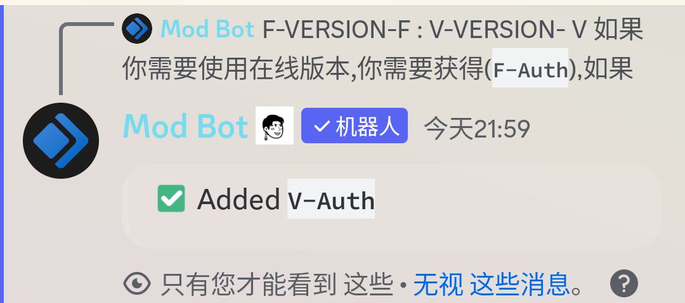
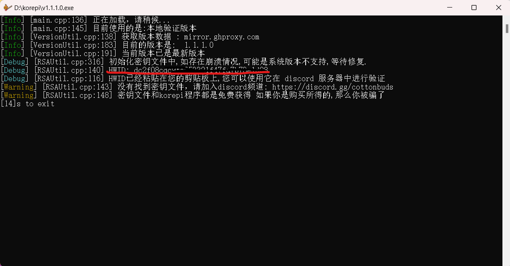
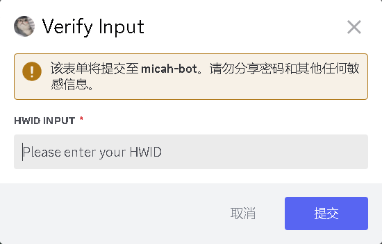
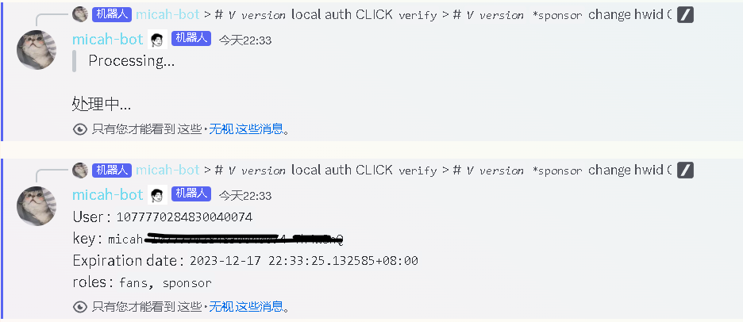

---
# 1.在频道中找到links下的 ★korepi-verison-roles★ 频道，点击并进入。
  - 选择你所需要的版本密钥身份，如下图：
  
  

  ## 点击F-Auth或者V-Auth

  ::: tip
  # korepi的F版本和V版本不区分所使用的服务器，F与V只是验证方式。
  
  - F是网络验证方式，中国大陆部分地区可能连接不上。
  - V是本地验证方式，建议中国大陆用户使用此版本。
  
  :::
  - 获取身份后会显示下图：
  - 
  
# 2.在频道中找到verification下的 ★Micah-bot-verify★，点击进入。
 - 找到Micah-bot所发的这则消息
 
 - 注：V：verify 是v版本获取密钥。
 - V：change hwid是sponsor权限更改hwid码可用于更换设备和重置密钥。
 - change verification 是sponsor权限更改验证版本。
 - F：Get key 是F版本获取密钥。
 - F：Reset key 是重置取消F版本所使用的密钥。
  ::: danger 
  # 请不要乱点验证，以免无法正常使用。
  :::
# 3.根据自己所需要的验证版本选择验证密钥
 ## v版本使用流程：
 - [1]打开v版本的korepi的注入器，会自动复制你的hwid在你的剪切板，如下图：
 - 
 - [2]点击v：verify会弹出。
 - 
 - [3]将你的hwid复制输入，bot会给你一个enc.json文件将它下载并和korepi放在一起。
 - 备注：如果bot，没发enc.json给你，再用一次v：verify。
  
 ## F版本使用流程：
 - [1]点击F：Get key，bot会在频道中发消息，如下：
 - 
 - [2]复制key：后面的micah-xxxx-xxx密钥。
 
 - [3]打开korepi，粘贴密钥进去即可。验证成功会生成license.json文件
  ::: danger 
 ### 如果打开korepi闪退请检查自己的网络是否流畅，VPN是否有开启。
  :::
