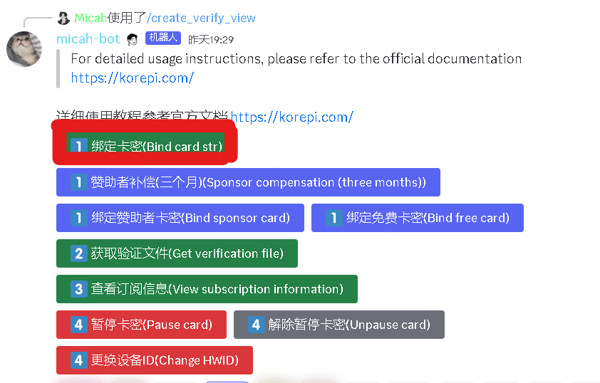
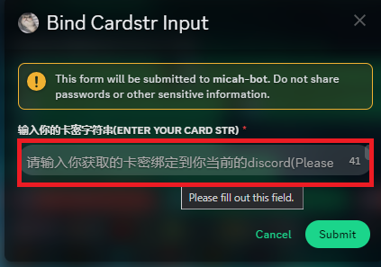
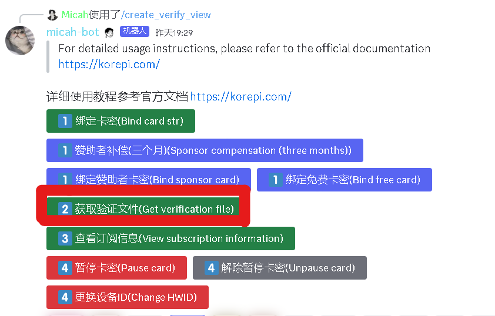
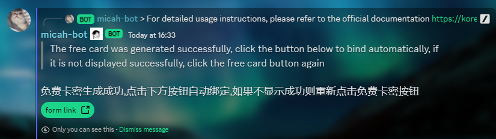
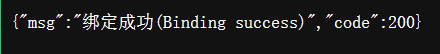
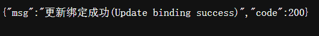
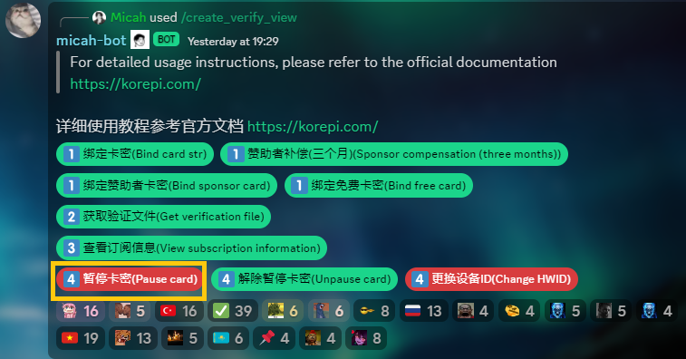
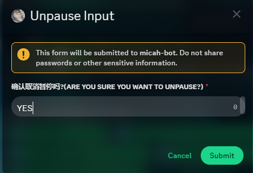
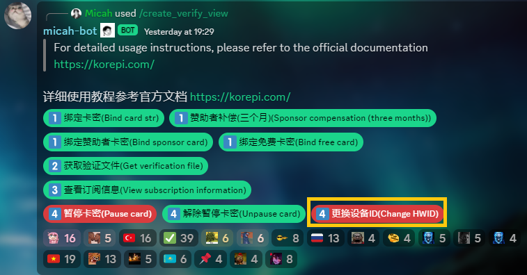
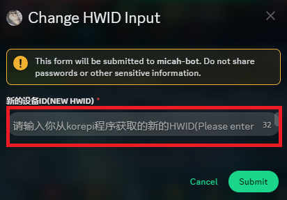

---

## 验证使用教程

- 找到`🔐｜verification`频道 [直链](https://discord.com/channels/1069057220802781265/1203687333107335198)
- 找到Micah-bot所发的这则消息
  
- 根据提示的流程来
- 如果你是2024年2月4日之前的Sponsor,点击`赞助者补偿`,然后输入`YES`,将会获得3个月的时间补偿
- 如果你不是,请点击`绑定卡密`,填写从各个渠道获取的密钥
- 然后点击`使用卡密获取验证文件`,需要你填写你的`hwid(设备id)`
- 之后将获取的enc.json文件放在与你的kp程序同目录下,即可正常运行
- 你还可以点击`查看订阅信息`来查看你的订阅信息
:::danger 如果你是赞助者（sponsor身份），请不要点击 `绑定赞助者卡密` 或者 `绑定免费卡密` ，这样视为放弃三个月的补偿！领取补偿截至日期到2023年3月6日凌晨12点00分
:::

# 详细教程

## 使用所购买的卡密

__**1. 点击〖1️⃣ 绑定卡密(Bind card str)〗。然后在弹出的窗口输入框处填入从经销商处购买得来的41位卡密，并点击Submit。**__

 

__**2. 打开你所下载的korepi，它会自动复制你的hwid码。**__
   :::tip 在你使用前看看你的korepi文件夹中是否有过期的enc.json文件，如果有的话，请删除。
   :::

__**3. 点击〖2️⃣ 获取验证文件(Get verification file)〗，输入hwid码，然后点击submit。**__

__**4. 下载enc.json文件，将文件放在korepi文件夹中。**__

__**5. 打开korepi，即可使用。**__

:::tip 视频教程
:::
<iframe width="560" height="315" src="https://www.youtube.com/embed/N6odK8Q6LEE?si=LLIeftUPtpyNVKuE" title="YouTube video player" frameborder="0" allow="accelerometer; autoplay; clipboard-write; encrypted-media; gyroscope; picture-in-picture; web-share" allowfullscreen></iframe>

## sponsor使用教程

:::tip sponsor的密钥时间为7天，过期后请删除旧的enc.json文件，重新获取新的。
:::
:::danger 注意：sponsor身份已不再发放。
:::
__**1. 点击〖1️⃣ 绑定赞助者密钥(Bind sponsor card)〗**__

- 然后进入链接，自动绑定赞助密钥。

___**2. 打开你所下载的korepi，它会自动复制你的hwid码。**__
   :::tip 在你使用前看看你的korepi文件夹中是否有过期的enc.json文件，如果有的话，请删除。
   :::

__**3. 点击〖2️⃣ 获取验证文件(Get verification file)〗，输入hwid码，然后点击submit。**__

__**4. 下载enc.json文件，将文件放在korepi文件夹中。**__

__**5. 打开korepi，即可使用。**__

:::tip 视频教程 待更新！
:::

## 免费版使用教程

:::tip 免费的密钥时间为1天，过期后请删除旧的enc.json文件，重新获取新的。
:::

__**1. 点击〖1️⃣ 绑定免费卡密(Bind free card)〗。自动跳转看广告获取免费卡密。**__
 
 

__**成功后将在频道底部得到此信息**__

__**点击〖form link〗后将让您经历一段广告洗礼，并在最后出现以下提示**__
__** 一般会提示绑定成功(Binding success)**__

__**当您存在另个仍在活跃的密钥时，才会提示更新绑定成功(Update binding success) (已编辑)**__

__**2. 打开你所下载的korepi，它会自动复制你的hwid码。**__
   :::tip 在你使用前看看你的korepi文件夹中是否有过期的enc.json文件，如果有的话，请删除。
   :::

__**3. 点击〖2️⃣ 获取验证文件(Get verification file)〗，输入hwid码，然后点击submit。**__

__**4. 下载enc.json文件，将文件放在korepi文件夹中。**__

__**5. 打开korepi，即可使用。**__

:::tip 视频教程
:::

<iframe width="560" height="315" src="https://www.youtube.com/embed/WGmro7aRmOw?si=b1ywSsKaB-MU-cpT" title="YouTube video player" frameborder="0" allow="accelerometer; autoplay; clipboard-write; encrypted-media; gyroscope; picture-in-picture; web-share" allowfullscreen></iframe>

## 暂停卡密

# __**暂停和解除暂停卡密（仅限订阅者Subscription/PERTAMAX）**__

> __**暂停和解除暂停卡密的方法，每个月能暂停一次**__

## __暂停卡密__

__**1. 点击**〖4️⃣  暂停卡密(Pause card)〗**__

__**2. 在弹出的窗口输入框处输入『YES』（全大写），并点击Submit即可**__

## 解除暂停卡密

__**1.点击〖  解除暂停卡密(Unpause card)〗**__

__**2.在弹出的窗口输入框处输入『YES』（全大写），并点击Submit即可**__

## 更改设备

# __**更换设备**__

> __**更换密钥绑定的设备(HWID)的方法，每7天能更换一次**__

__**1. 点击**〖4️⃣  更换设备ID(Change HWID)〗**__

__**2. 在弹出的窗口输入框处填入您新的设备ID，并点击Submit**__

__**3. 打开你所下载的korepi，它会自动复制你的hwid码。**__
   :::tip 在你使用前看看你的korepi文件夹中是否有过期的enc.json文件，如果有的话，请删除。
   :::

__**4. 点击〖2️⃣ 获取验证文件(Get verification file)〗，输入hwid码，然后点击submit。**__

__**5. 下载enc.json文件，将文件放在korepi文件夹中。**__

__**6. 打开korepi，即可使用。**__
## md5校验问题

- 每次重新获得`enc.json`文件后,之前的`enc.json`文件都会失效
- 如果你最新获得的还是失效,请重新获得文件,如果还不行,等待一段时间后再试

## 上不了discord,谷歌等

[梯子推荐](../others/ap.md)

## 与bot交互失败
- 请在[rule频道](https://discord.com/channels/1069057220802781265/1075789470789546024)点击verify验证，bot就不会显示交互失败。
  
